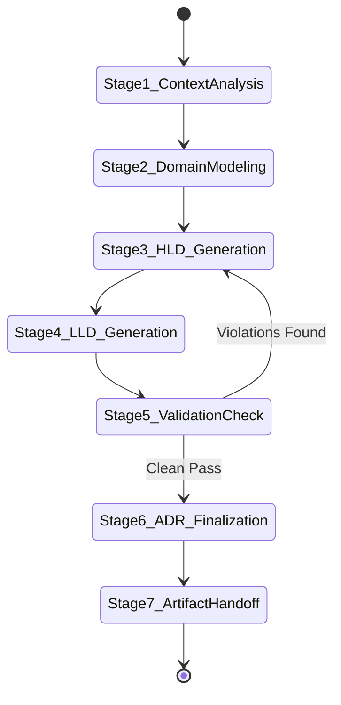

# System Architecture Skill Specification

## 1. Purpose & Organizational Context
`system-architecture` is the production-grade architectural design skill for our AI-first Quantitative Trading Platform engineering organization. It automates the transformation of approved product requirements into implementation-ready High-Level Design (HLD), Low-Level Design (LLD), and Architecture Decision Records (ADRs).

The outputs of this skill serve as direct, authoritative inputs for:
- Database Design & Schema Engineering
- API First Contract Design (gRPC / OpenAPI / GraphQL)
- High-Performance Backend Engineering (C++ / Go / Python / Java)
- Frontend Real-Time Dashboard Engineering
- Cloud & High-Performance Infrastructure Engineering
- Automated QA & Performance Benchmark Testing

### Organizational Engineering Philosophy:
- **Build Simple First**: Default to simple, clear, maintainable designs.
- **Scale When Necessary**: Do not add distributed complexity ahead of verified bottlenecks.
- **Modular Monolith by Default**: Prefer strongly-isolated modular monoliths before microservices unless multi-team autonomy or independent hardware scaling requires decomposition.
- **Avoid Overengineering**: Eliminate speculative abstractions (YAGNI).
- **Mandatory Trade-off Analysis**: Every architectural decision MUST explicitly detail evaluated trade-offs, pros, cons, and failure modes.

---

## 2. Activation Rules & Trigger Patterns

### 2.1 Positive Trigger Patterns
Activate `system-architecture` when:
- The user requests to design, architect, or structure a system, subsystem, microservice, or modular component.
- The user requests High-Level Design (HLD) or Low-Level Design (LLD) documentation.
- The user asks for architecture trade-off analysis, technology stack selection, or Architecture Decision Records (ADRs).
- Prompt keywords include: *"design system architecture"*, *"generate HLD"*, *"generate LLD"*, *"architect trading platform"*, *"design risk engine"*, *"architect OMS/EMS"*, *"design AI agent platform"*, *"create ADR"*.

### 2.2 Negative Activation Constraints
DO NOT activate `system-architecture` when:
- The request is purely for writing isolated function code or fixing a single bug without architectural scope.
- The request is for initial product requirement gathering (use `requirement-analysis` skill instead).
- The user asks general non-architectural questions.

### 2.3 Context Disambiguation Rules
If user intent is ambiguous (e.g., *"How should we handle order matching?"*):
1. Ask if they need a complete **High-Level Design (HLD)**, a **Low-Level Design (LLD)**, or an **Architecture Decision Record (ADR)**.
2. If confirmed, initiate the End-to-End System Architecture State Machine.

---

## 3. Inputs & Context Schemas

| Parameter Name | Data Type | Required? | Description | Validation Rule |
| :--- | :--- | :---: | :--- | :--- |
| `requirement_doc` | String / File Path | Yes | Path or content of approved Product Requirement Document (PRD) | Must contain functional and non-functional requirements |
| `target_scope` | String | Yes | Target scope: `FULL_SYSTEM`, `HLD`, `LLD`, `ADR`, or `MODULE` | Must match enum values |
| `latency_target` | String | Optional | Target latency SLA (e.g., `< 100 microseconds`, `< 5 milliseconds`) | String format |
| `deployment_target` | String | Optional | Deployment environment (`On-Premises Bare-Metal`, `AWS`, `Hybrid`) | Defaults to `Hybrid` |
| `output_dir` | String | Optional | Directory path to save generated architecture artifacts | Defaults to workspace docs directory |

---

## 4. Outputs & Artifact Specifications

| Output Artifact | Path / Format | Description |
| :--- | :--- | :--- |
| **High-Level Design (HLD)** | `docs/architecture/HLD_<system_name>.md` | C4 context/container diagrams, tech stack, scalability, security, ADRs |
| **Low-Level Design (LLD)** | `docs/architecture/LLD_<module_name>.md` | Package structure, class designs, sequence diagrams, DB schema, testing |
| **Architecture Decision Record** | `docs/architecture/adr/ADR_<num>_<title>.md` | Problem statement, options considered, trade-offs, decision outcome |
| **Validation Report** | Brain Artifact / Markdown | Automated evaluation against SOLID, KISS, YAGNI, security, and performance rules |

---

## 5. End-to-End Workflow State Machine

The System Architecture Workflow executes through a 7-stage state machine:

### Stage Execution Details:
1. **Stage 1: Business Context & NFR Analysis**: Inspect requirements for performance SLAs, latency budgets, throughput, security, and compliance.
2. **Stage 2: Domain Modeling & Bounded Context Discovery**: Apply Domain-Driven Design (DDD) to isolate domain aggregates, bounded contexts, and ubiquitous language.
3. **Stage 3: High-Level Design (HLD) Generation**: Generate Level 1 & Level 2 C4 diagrams, technology stack selection matrix, and cross-cutting strategies using [templates/hld_template.md](templates/hld_template.md).
4. **Stage 4: Low-Level Design (LLD) Generation**: Generate package layouts, class/struct blueprints, sequence diagrams, database DDLs, and error handling strategies using [templates/lld_template.md](templates/lld_template.md).
5. **Stage 5: Architectural Validation**: Run `scripts/architecture_validator.py` to verify compliance with SOLID, DRY, KISS, YAGNI, latency targets, and security rules.
6. **Stage 6: ADR & Trade-off Finalization**: Create explicit ADR records in `docs/architecture/adr/` capturing all major architectural choices and trade-offs using [templates/adr_template.md](templates/adr_template.md).
7. **Stage 7: Handoff & Artifact Generation**: Deliver clean, clickable Markdown artifacts and synthesis to the user.

---

## 6. Decision Process & Reasoning Strategy

When formulating system designs, strictly adhere to the following cognitive reasoning process:

1. **Quant Trading Latency Budget Allocation**:
   - Market Data Ingestion & Normalization: $< 50\mu\text{s}$
   - Pre-Trade Risk Verification: $< 100\mu\text{s}$
   - OMS State Persistence & Outbox: $< 500\mu\text{s}$
   - FIX Routing & Gateway Execution: $< 250\mu\text{s}$
   - AI / LLM Inference Path: $< 5\text{ms}$ to $500\text{ms}$ depending on model size.

2. **Modular Monolith vs Microservice Scrutiny**:
   - Always attempt to build as a **Modular Monolith** first.
   - Only justify microservice splitting if independent hardware requirements exist (e.g. GPU inference nodes vs CPU tick handlers) or team deployment independence demands it.

3. **Data Integrity & Consistency Rules**:
   - Financial balances, positions, and order states require **Strong Consistency** (PostgreSQL ACID, Transactional Outbox).
   - Real-time streaming charts and visual analytics dashboards accept **Eventual Consistency** (Redis PubSub / ClickHouse).

4. **Defensive Architectural Principles**:
   - Validate every design against SOLID, KISS, YAGNI, and Separation of Concerns.
   - Any violation of these principles MUST be explicitly documented with a trade-off justification in the architecture report.

---

## 7. Quality Gates & Automated Validation

Every generated architectural design MUST pass automated validation via `scripts/architecture_validator.py`.

### Quality Gate Checkpoints:
- [ ] **Structural Completeness**: HLD contains all required 9 sections; LLD contains all 6 package & code design sections.
- [ ] **Diagram Coverage**: Contains valid Mermaid C4 diagrams (Context, Container, Component, or Sequence).
- [ ] **Trade-off Analysis**: Every major technology choice includes an ADR with pros, cons, and alternatives.
- [ ] **Security & Compliance**: AuthN/AuthZ, mTLS, and WORM financial audit trail incorporated.
- [ ] **Observability**: 4 Golden Signals and OpenTelemetry distributed tracing integrated.
- [ ] **Automated Script Audit**: `python3 scripts/architecture_validator.py --doc-path <path>` executes with ZERO errors.

---

## 8. Failure Conditions & Recovery Runbooks

| Failure Symptom | Root Cause | Diagnosis Command | Remediation Action |
| :--- | :--- | :--- | :--- |
| **Validation Script Failure** | Missing required section in HLD/LLD doc | `python3 scripts/architecture_validator.py --doc-path <path>` | Populate missing sections from `templates/hld_template.md` or `templates/lld_template.md` |
| **Ambiguous Context Boundary** | Overlapping responsibilities between modules | Inspect bounded context map in HLD | Refactor domain boundaries according to DDD context mapping rules in `references/01_architecture_patterns.md` |
| **Latency SLA Breach** | Synchronous DB queries on critical risk path | Inspect sequence diagram and class design | Move database writes to asynchronous Transactional Outbox pattern; keep risk checks in-memory |

---

## 9. References & Deep Dive Knowledge Base

Refer to the specialized reference guides in `references/` for detailed architectural patterns:
- [01_architecture_patterns.md](references/01_architecture_patterns.md): C4 Model, Arc42, Modular Monoliths, DDD, Hexagonal, CQRS, Event Sourcing, Saga, Outbox.
- [02_trading_system_architecture.md](references/02_trading_system_architecture.md): Market Data (L1/L2/L3), Order Lifecycle, OMS, EMS, Pre-Trade Risk Engine, Backtesting.
- [03_ai_and_rag_architectures.md](references/03_ai_and_rag_architectures.md): LLM Gateways, Model Router, RAG Pipelines, Vector DBs, HITL AI Agents.
- [04_distributed_systems_and_messaging.md](references/04_distributed_systems_and_messaging.md): Kafka, Redis, PostgreSQL, ClickHouse, Distributed Locks, Idempotency.
- [05_security_observability_compliance.md](references/05_security_observability_compliance.md): OAuth2, mTLS, OpenTelemetry, WORM Audit Logs, MiFID II / SEC Rule 15c3-5.

---

## 10. Reusable Templates & Worked Examples

### Templates:
- [hld_template.md](templates/hld_template.md): High-Level Design Template
- [lld_template.md](templates/lld_template.md): Low-Level Design Template
- [adr_template.md](templates/adr_template.md): Architecture Decision Record Template
- [component_specification.md](templates/component_specification.md): Component Interface Specification
- [tradeoff_analysis_template.md](templates/tradeoff_analysis_template.md): Trade-off Analysis Specification
- [architecture_review_checklist.md](templates/architecture_review_checklist.md): Architecture Review & Quality Gate Checklist

### Worked Examples:
- [trading_platform_hld.md](examples/trading_platform_hld.md): Enterprise Quantitative Trading Platform HLD
- [order_management_system_lld.md](examples/order_management_system_lld.md): Order Management System (OMS) LLD
- [ai_agent_platform_hld.md](examples/ai_agent_platform_hld.md): Quantitative AI Agent Platform HLD
- [risk_engine_hld_lld.md](examples/risk_engine_hld_lld.md): Pre-Trade Risk Engine HLD/LLD
